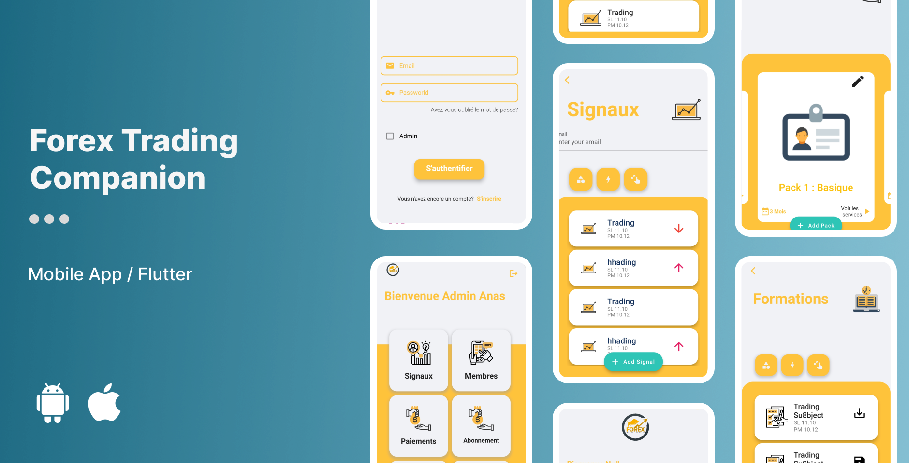

# Trading Forex Application

## Welcome to the Trading Forex Application!
The Trading Forex Application is a Flutter-based mobile app that offers users a comprehensive platform for accessing forex insights, educational resources, and trading formations. It also features an admin functionality for managing users and controlling access to educational content.

## Features

### User Features
- Gain access to valuable forex insights and information.
- Explore a wide range of trading formations and educational resources.

### Admin Features
- Effortlessly add and manage users within the app.
- Maintain control over access to educational content and resources.

## Getting Started
To get started with DeliveryPro, follow these steps:

1. Clone this repository.
2. Install Flutter and Dart if you haven't already.
3. Run `flutter pub get` to install dependencies.
4. Modify the app to suit your specific needs.
5. Run the app on your preferred emulator or physical device.

## License
This project is licensed under the MIT License - see the [LICENSE](LICENSE) file for details.
